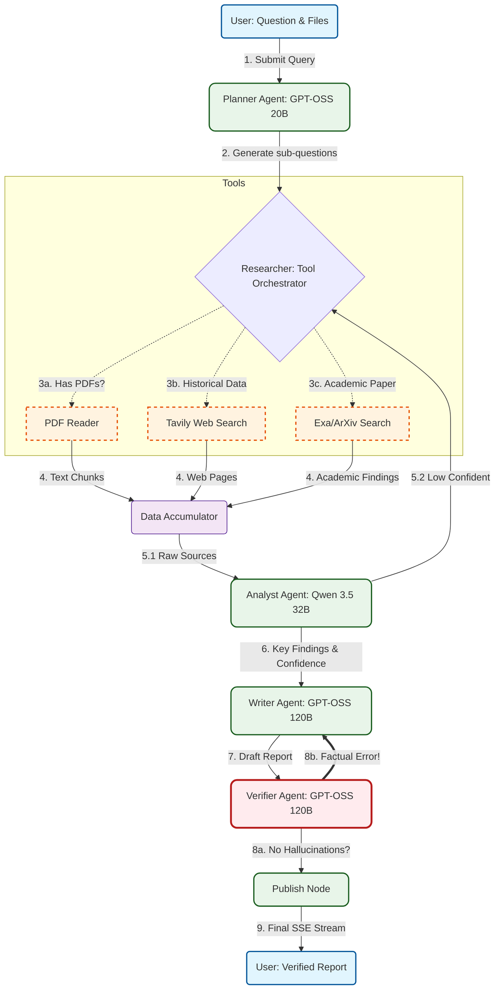

# Research Intelligence Agent

**An advanced automated research platform powered by LangGraph, Groq, and Tavily.** This system implements a sophisticated Multi-Agent architecture to provide transparent, verified, and high-fidelity research reports from both web and local PDF sources.

---

## System Overview

The system transitions from a simple linear pipeline to an **Intelligent Feedback Loop** architecture, ensuring "Full Transparency" through a real-time Reasoning Log.

## 📂 Project Structure

```text
research-intelligence-agent/
├── backend/                    
│   ├── agents/                 <-- Multi-agent logic
│   │   ├── planner_agent.py    <-- Query decomposition
│   │   ├── researcher_agent.py <-- Dynamic Tool Orchestration
│   │   ├── analyst_agent.py    <-- Credibility & confidence scoring
│   │   ├── writer_agent.py     <-- Academic synthesis
│   │   ├── verifier_agent.py   <-- Hallucination detection
│   │   └── helper.py           <-- Utilities (SSE emit, JSON extraction)
│   ├── tools/                  <-- Real-world interfaces
│   │   ├── tavily_tool.py      <-- Web Search
│   │   └── pdf_reader.py       <-- Local PDF context
│   ├── requirements/           <-- Requirements
│   │   ├── base.txt            <-- For using
│   │   └── dev.txt             <-- For developing and testing
│   ├── tests/                  <-- Unit & Integration suites
│   ├── params.yaml             <-- DVC: Version controlled Prompts/Models
│   ├── graph.py                <-- StateGraph definition
│   ├── main.py                 <-- FastAPI & SSE Streaming logic
│   ├── Dockerfile              <-- Optimized Python slim build
│   └── .env                    <-- API keys (GROQ, TAVILY)
├── frontend/                   
│   ├── components/             <-- Atomic UI components
│   │   ├── ChatPanel.tsx       <-- Chat interface
│   │   ├── ReasoningLog.tsx    <-- Real-time "Thinking" log
│   │   ├── ArtifactPanel.tsx   <-- Citation & SourceCard display
│   │   └── ToolCallCard.tsx    <-- Arguments & Output transparency
│   │   └── SourceCard.tsx      <-- SourceCard display
│   ├── app/                    <-- Next.js 14 App Router
│   ├── lib/                    <-- Types, Utils
│   ├── Dockerfile              <-- Multi-stage production build
│   └── .env                    <-- API URL configuration
├── docker-compose.yml          <-- Full-stack orchestration
└── README.md                   <-- Design Document
```


### The Pipeline Architecture:


1.  **Planner (GPT-OSS 20B):** Decomposes complex queries into 3-5 targeted sub-questions.
2.  **Researcher (Tool Orchestrator):** Dynamically selects between **Tavily Search**, **ArXiv**, and **PDF Reader** based on query intent.
3.  **Analyst (Qwen 3.5 32B):** Evaluates source credibility, extracts key findings, and calculates an `overall_confidence` score.
4.  **Writer (GPT-OSS 120B):** Synthesizes a 500-700 word academic report with inline citations.
5.  **Verifier (GPT-OSS 120B):** Fact-checks the draft against raw sources. If errors are found, it triggers a **Revision Loop** back to the Writer.
6.  **Publisher:** Streams the final, verified report to the UI once quality is guaranteed.


---

## Installation Instructions

### Prerequisites
* **Python 3.11+**
* **Conda** (recommended)
* **Docker & Docker Compose**
* **API Keys:** Groq, Tavily.

### Local Setup (Conda)
```bash
# Clone the repository
git clone https://github.com/your-username/research-intelligence-agent.git
cd research-intelligence-agent

# Create and activate environment
conda create -n research-agent python=3.11 -y
conda activate research-agent

# Install dependencies
pip install -r backend/requirements.txt
```

### Environment Variables (.env)
Create a `.env` file in the `backend/` directory:
```env
GROQ_API_KEY=your_groq_key_here
TAVILY_API_KEY=your_tavily_key_here
TAVILY_MAX_RESULTS=your_max_results_you_want
```

Create a `.env` file in the `frontend/app/api/chat/` directory:
```env
# FastAPI backend URL
BACKEND_URL=http://localhost:8000
```

### DVC Setup
We use **DVC (Data Version Control)** to manage our prompt templates and model parameters (`params.yaml`), ensuring experiments are reproducible.

```bash
# Initialize DVC
dvc init

# Track configuration files
# Update model params or prompts in params.yaml
dvc commit params.yaml
git add params.yaml.dvc
git commit -m "Experiment: Switch Analyst to Qwen 3.5"
```

---

## Model Experimentation & Selection

During development, we benchmarked multiple models on Groq to find the optimal balance between **TPM (Tokens Per Minute)** and **Reasoning Quality**.

| Agent | Selected Model | Reasoning |
| :--- | :--- | :--- |
| **Planner** | `openai/gpt-oss-20b` | Low latency, high-speed query decomposition. |
| **Analyst** | `qwen3-32b` | Superior JSON formatting and context understanding. |
| **Writer** | `openai/gpt-oss-120b` | High-fidelity academic writing and synthesis. |
| **Verifier** | `openai/gpt-oss-120b` | Zero-shot fact-checking and contradiction detection. |

---

## How to Run

### 1. Manual Start
**Backend:**
```bash
cd backend
uvicorn main:app --reload --port 8000
```
**Frontend:**
```bash
cd frontend
npm install
npm run dev
```

### 2. Docker Setup (Production Mode)
```bash
docker-compose up --build
```
The system will be available at `http://localhost:3000` with the API running at `http://localhost:8000`.

### 3. Run backend test case
```bash
cd backend
python -m tests.testbackend
python -m tests.test_streaming_latency
```

---

## Deployment

The system is containerized using **Multi-stage Docker builds** for the Frontend to minimize image size and **Uvicorn** for high-performance Backend serving.

* **CI/CD:** Integrated with GitHub Actions for automated testing via `pytest`.
* **Scaling:** Stateless FastAPI design allows for horizontal scaling behind a Load Balancer.
* **Streaming:** Uses **Server-Sent Events (SSE)** with `X-Accel-Buffering: no` to bypass Nginx buffering for real-time UI updates.

---

### Key Technical Highlights
* **Zero-Hallucination Focus:** Implemented a Critic-Correction loop between Writer and Verifier.
* **Real-time Transparency:** Built a custom SSE streaming logic for the "Reasoning Log" to show Agent "Thinking" steps.
* **Tool Orchestration:** Intelligent routing between Web Search and local PDF context.
