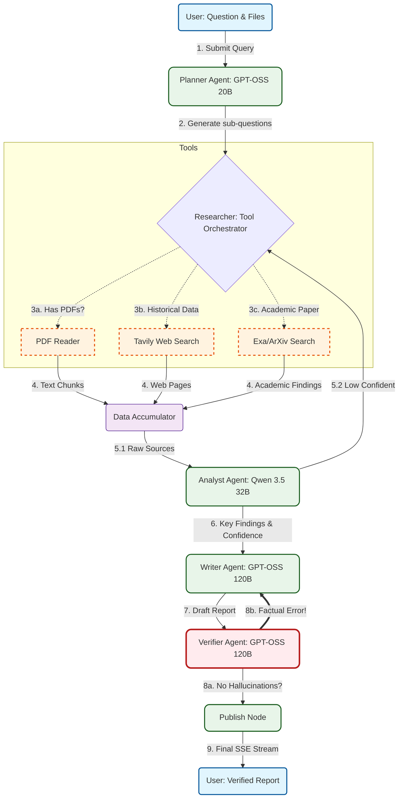

## The Pipeline Architecture:

1.  **Planner (GPT-OSS 20B):** Decomposes complex queries into 3-5 targeted sub-questions.
2.  **Researcher (Tool Orchestrator):** Dynamically selects between **[Tavily Search](https://www.tavily.com/)**, **[ArXiv](https://arxiv.org/)**, and **[PDF Reader](https://pymupdf.io/)** based on query intent.
3.  **Analyst (Qwen 3.5 32B):** Evaluates source credibility, extracts key findings, and calculates an `overall_confidence` score.
4.  **Writer (GPT-OSS 120B):** Synthesizes a 500-700 word academic report with inline citations.
5.  **Verifier (GPT-OSS 120B):** Fact-checks the draft against raw sources. If errors are found, it triggers a **Revision Loop** back to the Writer.
6.  **Publisher:** Streams the final, verified report to the UI once quality is guaranteed.
