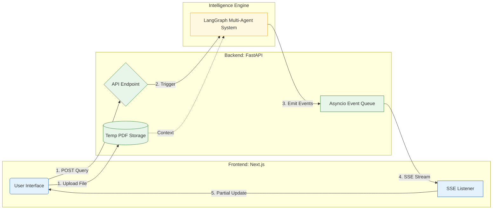

## Project structure
```text
research-intelligence-agent/
├── backend/                    
│   ├── agents/                 <-- Multi-agent logic
│   │   ├── planner_agent.py    <-- Query decomposition
│   │   ├── researcher_agent.py <-- Dynamic Tool Orchestration
│   │   ├── analyst_agent.py    <-- Credibility & confidence scoring
│   │   ├── writer_agent.py     <-- Academic synthesis
│   │   ├── verifier_agent.py   <-- Hallucination detection
│   │   └── helper.py           <-- Utilities (SSE emit, JSON extraction)
│   ├── tools/                  <-- Real-world interfaces
│   │   ├── tavily_tool.py      <-- Web Search
│   │   └── pdf_reader.py       <-- Local PDF context
│   ├── requirements/           <-- Requirements
│   │   ├── base.txt            <-- For using
│   │   └── dev.txt             <-- For developing and testing
│   ├── tests/                  <-- Unit & Integration suites
│   ├── params.yaml             <-- DVC: Version controlled Prompts/Models
│   ├── graph.py                <-- StateGraph definition
│   ├── main.py                 <-- FastAPI & SSE Streaming logic
│   ├── Dockerfile              <-- Optimized Python slim build
│   └── .env                    <-- API keys (GROQ, TAVILY)
├── frontend/                   
│   ├── components/             <-- Atomic UI components
│   │   ├── ChatPanel.tsx       <-- Chat interface
│   │   ├── ReasoningLog.tsx    <-- Real-time "Thinking" log
│   │   ├── ArtifactPanel.tsx   <-- Citation & SourceCard display
│   │   └── ToolCallCard.tsx    <-- Arguments & Output transparency
│   │   └── SourceCard.tsx      <-- SourceCard display
│   ├── app/                    <-- Next.js App Router
│   ├── lib/                    <-- Types, Utils
│   ├── Dockerfile              <-- Multi-stage production build
│   └── .env                    <-- API URL configuration
├── docker-compose.yml          <-- Full-stack orchestration
└── README.md                   <-- Design Document
```

## System Interaction & Data Flow

This diagram illustrates how the **Frontend (Next.js)** and **Backend (FastAPI/LangGraph)** communicate in real-time to provide a seamless research experience.



### Architectural Component Descriptions

#### 1. Client-Side (Frontend - [Next.js](https://nextjs.org/))
* **SSE Client:** Unlike standard REST APIs, the frontend maintains a persistent connection using **Server-Sent Events (SSE)**. This allows the UI to update incrementally as the agents progress, preventing the user from waiting for a single "long-poll" response.
* **State Management:** Dynamically renders the **Reasoning Log** and **Artifact Panel**. It handles complex string manipulation to ensure that streaming text wraps correctly without breaking the layout.

#### 2. Server-Side (Backend - [FastAPI](https://fastapi.tiangolo.com/))
* **Asynchronous Orchestration:** FastAPI manages the request lifecycle, triggering the **LangGraph** execution in a separate thread/task. It utilizes an internal `asyncio.Queue` to bridge the gap between Agent outputs and the HTTP stream.
* **Buffer Breaker:** To ensure real-time delivery through proxies (like Nginx), the backend implements a "Buffer Breaker" (2KB padding) to force the data through the network stack immediately.

#### 3. Intelligence Layer ([LangGraph](https://www.langchain.com/langgraph) & Agents)
* **Stateful Workflow:** The **StateGraph** acts as the system's "brain", maintaining a `ResearchState` object that stores everything from raw search results to the final verified report.
* **The Verifier Loop:** A critical design pattern where the **Verifier Agent** acts as a quality gate. If the score is below the threshold, the state is routed back to the **Writer Agent** for revision, ensuring the final output is grounded in fact.

#### 4. Data Layer (Tools & MLOps)
* **Hybrid Search:** The system dynamically routes queries between **[Tavily](https://www.tavily.com/) (External Web)** and **[PyMuPDF](https://pymupdf.io/) (Internal PDF)**, allowing for a comprehensive analysis of both public and private data.
* **[DVC](https://dvc.org/) Integration:** Prompts are treated as code artifacts. By using `params.yaml`, we can version-control the "personality" and "logic" of our agents independently of the core application logic.
